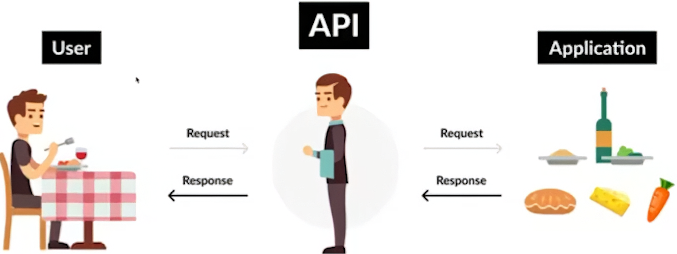

# Machine Learning Engineering

# Python para ML e IA

## Aula 1 - Por que a pessoa engenheira de Machine Learning precisa saber APIs?

O engenheiro de Machine Learning é responsável por transformar um modelo em produto.

É muito comum termos um modelo de ML rodando localmente, em nossos notebooks, não entregando valor contínuo para o negócio. Para resolver esse problema, precisamos criar um serviço consumivel (API).

### Definições

* API
Application Programming Interface, um conjunto de regras e protocolos que permite a comunicação entre diferentes softwares, fornecendo rotas para acessar funcionalidades específicas.

O usuário vai pedir o prato, o garçom (API) vai levar o pedido para a cozinha (servidor) e depois trazer a comida pronta para o usuário.

* Qual o papel de uma API em Machine Learning?
1. Conecta o modelo treinado a aplicações finais.
2. Recebe dados de entrada e retorna previsões.
3. Evita explosição desnecessária do código para os usuários finais.

* Por que integrar ML e APIs?
1. Disponibilizar previsões em tempo real.
2. Padronizar acesso a modelos entre diferentes sistemas.
3. Ganhar escalabiliodade: cada serviço cuida  de uma parte.
4. Melhorar a segurança: controle de quem acessa o modelo.
5. Otimizar o desenvolvimento colaborativo.
6. Tornar o modelo um `produto` de fato.

### Exemplos práticos
1. Sistema de recomendação de filmes via endpoint /recommend.
2. Análise de sentimento para redes sociais e help desk.
3. Classificação de imagem em apps de diagnóstico médico.
4. Previsão de demanda em e-commerce.
5. Google Maps API: Permitindo que desenvolvedore integrem mapas, rotas e funcionalidades em seus aplicativos.
6. Twitter API: fornece acesso aos dados de tweets, permitindo que desenvolvedores criem análise de sentimento dos tweets.

### Exemplo de fluxo
Recomendação de filmes:
1. Usuário envia histórico de preferências via POST;
2. API processa dados e consulta modelo de recomendação;
3. Resposta é uma lista de filmes sugeridos;
4. Front-end recebe e exibe para o usuário;
5. Tudo isso sem revelar a lógica interna do modelo.

### API Rest
* REST (Representational State Transfer) é um estilo arquitetural para projetar APIs.
* Utiliza métodos HTTP (GET, POST, PUT, DELETE) para operações.
* Stateless: cada requisição é independente.
* Cacheável: melhora desempenho e escalabilidade.

* Exemplo de endpoint:
1. URL: https://api.meusistema.com/predict
2. Método: POST com payload de dados.
3. Resposta: JSON com previsões.
4. Separação clara entre cliente e servidor.
5. Permite versionamento: /v1/predict, /v2/predict.

### Dicas de estrutura de Endpoints
1. Usar verbos HTTP corretamente (GET para obter dados, POST para criar).
2. Nomear endpoints de forma intuitiva (/predict, /train).
3. Evitar URLs muito longas ou complexas.
4. Retornar códigos de status HTTP adequados (200, 400, 500).
5. Manter consistência entre endpoints e parâmetros.

### Boas práticas para o desenvolvimento
1. Código limpo e organizado por rotas.
2. Padrões claros de nomenclatura.
3. Testes unitários e de integração.
4. Manter a lógica de negócio separada da lógica de API.
5. Evitar "tudo em um único arquivo".
6. Uso de ambientes virtuais e gerenciadores de dependências.
7. Lidar com exceções e erros de forma adequada.
8. Logar eventos críticos e respostas do servidor.
9. Garantir retornos em JSON.
10. Reduzir latência com otimizações simples.

### Autenticação e autorização
* Autenticação: Verifica a identidade do usuário (ex: tokens, API keys).
* Autorização: Define o que o usuário autenticado pode fazer (ex: permissões).

### Documentação com Swagger
* Ferramenta para documentar APIs de forma interativa e atualizada.
* Permite testar endpoints diretamente na documentação.
* Reduz a curva de aprendizado para novos desenvolvedores.

### Ferramebtas e arquiteturas
* Fast API
Framework moderno e rápido para APIs em Python, com validação automática de dados e documentação integrada. 
* Flask
Framework leve e flexível que permite criar APIs simples e rápidas, ideal para prototipagem e projetos de ML.
* Django Rest Framework
Extensão do Django para construir APIs robustas e escaláveis, com suporte a autenticação, permissões e serialização de dados.

Neste curso passaremos mais por Fast API e Flask.

### Desafios em produção
1. Latência: Ocorre quando o tempo de resposta é alto. Para mitigar isso, precisamos otimizar  o código, usar caching e balanceamento de carga. Além de monitorar o desempenho constantemente.
2. Escalabilidade: Aumentar a capacidade do sistema para lidar com mais requisições. Utilizar contêineres (Docker), orquestração (Kubernetes) e serviços em nuvem (AWS, GCP).
3. Segurança: Proteger dados sensíveis e evitar ataques. Implementar autenticação, autorização, criptografia e monitoramento de segurança.
4. Custo: Gerenciar os custos operacionais. Otimizar recursos, usar serviços sob demanda e monitorar gastos regularmente.

## Aula 2 - Desenvolvimento de API com Flask
Flask é um micro framework web para Python, ideal para criar APIs de forma rápida e simples. Ele é leve, flexível e fácil de aprender, tornando-o uma ótima escolha para projetos de Machine Learning.

## Aula 4 - Ferramentas Necessárias I
### Ferramentas Python: `pyenv`, `pipx` e `Poetry`

#### 1. `pyenv`

##### O que é?
`pyenv` é uma ferramenta para **gerenciar múltiplas versões do Python** instaladas na sua máquina. Permite trocar facilmente entre versões específicas do Python, sem afetar a versão do sistema.

##### Para que serve?
- Instalar várias versões diferentes do Python.
- Alternar entre versões, por projeto ou globalmente.
- Testar compatibilidade do seu código em diferentes versões.

##### Exemplo de uso
Use `'pyenv install 3.10.6'` para instalar uma versão específica, e `'pyenv global 3.10.6'` para definir como padrão.

##### Quando usar?
- Quando você trabalha com vários projetos que exigem versões diferentes do Python.
- Quando quer manter a instalação do Python do sistema intacta.

---

#### 2. `pipx`

##### O que é?
`pipx` serve para **instalar e rodar ferramentas de linha de comando escritas em Python** em ambientes isolados.

##### Para que serve?
- Instalar utilitários como `black`, `httpie`, `poetry`, `cookiecutter`, etc., sem interferir no ambiente Python do sistema.
- Rodar ferramentas diretamente do terminal com segurança.

##### Exemplo de uso
Use `'pipx install black'` para instalar a ferramenta, e depois execute com `'black .'`.

##### Quando usar?
- Quando quiser instalar ferramentas de desenvolvimento Python de forma segura e isolada.
- Para manter seu ambiente global mais limpo e estável.

---

#### 3. `Poetry`

##### O que é?
`Poetry` é uma ferramenta all-in-one para **gerenciar dependências, ambientes virtuais e empacotar projetos Python**.

##### Para que serve?
- Criar projetos com estrutura profissional.
- Instalar e travar dependências usando `pyproject.toml`.
- Gerenciar ambientes virtuais automaticamente.
- Publicar bibliotecas no PyPI.

##### Exemplo de uso
Use `'poetry new meu_projeto'` para criar um novo projeto, `'poetry add requests'` para adicionar dependências, e `'poetry run python script.py'` para rodar scripts.

##### Quando usar?
- Quando você quer um controle completo e moderno sobre as dependências do seu projeto.
- Para manter ambientes limpos e reprodutíveis.
- Ideal para projetos sérios ou de código aberto.

---

#### Comparativo Rápido

| Ferramenta | Função Principal | Atua em | Quando Usar |
|-----------|------------------|---------|-------------|
| `pyenv` | Gerenciar versões do Python | Sistema | Quando precisa de múltiplas versões instaladas |
| `pipx` | Rodar ferramentas CLI em ambientes isolados | Global | Quando instala ferramentas como `black`, `httpie` |
| `Poetry` | Gerenciar projetos e dependências | Por projeto | Quando quer um ambiente limpo, moderno e organizado |

---

#### 4. Pydantic

##### O que é?

Pydantic é uma biblioteca Python para **validação de dados e criação de modelos de dados baseados em tipos**. Ela utiliza **anotações de tipo do Python** para validar automaticamente entradas e garantir que os dados estejam corretos antes de serem usados.

É muito usada com frameworks como **FastAPI**, mas também é útil em qualquer aplicação Python que lide com dados estruturados.

---

##### Principais Recursos

- Validação automática de dados usando `type hints`
- Conversão automática de tipos (por exemplo, string para int se possível)
- Modelos reutilizáveis e aninhados
- Suporte a valores padrão e validações personalizadas
- Compatível com o sistema de tipos do Python 3.7+

---

##### Exemplo de uso

Criação de um modelo simples:

Use `'from pydantic import BaseModel'` e crie uma classe herdando de `BaseModel`. A biblioteca validará os dados automaticamente ao criar instâncias.

Exemplo básico:
- `'class Usuario(BaseModel): nome: str; idade: int'`
- `'usuario = Usuario(nome="Maria", idade="30")'`

Neste exemplo, mesmo que `'idade'` seja passada como string, Pydantic irá convertê-la para inteiro.

---

##### Quando usar?

- Ao lidar com **entrada de dados externos**, como JSONs de APIs, arquivos ou formulários.
- Para garantir que suas funções recebam **dados bem formatados** e seguros.
- Em **projetos modernos** que usam orientação a objetos e validação de dados centralizada.

---

##### Benefícios

- Reduz erros causados por dados mal formatados
- Garante consistência nos tipos de dados ao longo do código
- Facilita a escrita de APIs mais seguras e confiáveis
- Integração natural com editores, usando autocomplete e validação de tipos

---

##### Comparação com dataclasses

| Característica        | `dataclasses`      | `pydantic.BaseModel` |
|-----------------------|--------------------|-----------------------|
| Validação automática  | Não                | Sim                   |
| Conversão de tipos    | Não                | Sim                   |
| Dependência externa   | Não                | Sim                   |
| Suporte a JSON        | Limitado           | Avançado              |
| Uso comum             | Estrutura interna  | Entrada/validação     |

---

#### 5. Alembic

##### O que é?

Alembic é uma ferramenta de **migração de banco de dados** para aplicações Python que utilizam **SQLAlchemy**. Ele permite controlar versões do esquema do banco de dados ao longo do tempo, de forma segura, reprodutível e organizada.

---

##### Para que serve?

- Criar e aplicar **migrations** (alterações na estrutura do banco de dados)
- Controlar o histórico de mudanças no banco
- Compartilhar a estrutura do banco com outros desenvolvedores
- Versionar alterações no schema junto com o código da aplicação

---

##### Como funciona?

Alembic gera **scripts de migração** baseados nas mudanças feitas nos modelos SQLAlchemy. Esses scripts descrevem o que deve ser feito para atualizar (ou reverter) a estrutura do banco.

Exemplos típicos de alterações:
- Criar ou remover tabelas
- Adicionar ou remover colunas
- Alterar tipos de dados
- Adicionar constraints ou índices

---

##### Exemplo de comandos comuns

- `'alembic init alembic'` – Inicializa a estrutura do Alembic no projeto
- `'alembic revision --autogenerate -m "create users table"'` – Cria uma nova migration automaticamente
- `'alembic upgrade head'` – Aplica as migrations até a última versão
- `'alembic downgrade -1'` – Desfaz a última migration

---

##### Quando usar?

- Sempre que você estiver usando SQLAlchemy e quiser manter o banco de dados sincronizado com os modelos do seu código
- Em projetos profissionais onde múltiplas pessoas trabalham no mesmo banco
- Para versionar o schema do banco junto com o código-fonte

---

##### Integração com SQLAlchemy

O Alembic foi feito para ser usado com **SQLAlchemy**, e consegue analisar os modelos ORM para gerar scripts de migração automaticamente com o parâmetro `--autogenerate`.

Para isso funcionar, você precisa configurar a string de conexão e garantir que seus modelos estejam importados no contexto de execução do Alembic.

---

##### Benefícios

- Permite evolução segura do banco de dados
- Evita problemas em ambientes diferentes (dev, staging, produção)
- Históricos de alterações podem ser revisados com versionamento Git
- Suporte a upgrades e downgrades reversíveis

---

#### 6. Black

##### O que é?

Black é uma ferramenta de **formatação automática de código Python**, também conhecida como "the uncompromising Python code formatter". Ela aplica um estilo de código consistente e padronizado, com base em decisões automáticas de formatação.

---

##### Para que serve?

- Padronizar a formatação do código Python
- Garantir um estilo consistente em toda a base de código
- Evitar discussões sobre estilo em revisões de código
- Facilitar a leitura e manutenção do código

---

##### Como funciona?

Black lê os arquivos `.py` e reescreve o código seguindo regras rígidas e padronizadas, como:
- Uso de aspas duplas por padrão
- Linhas limitadas a 88 caracteres
- Espaçamento consistente entre funções, classes, parâmetros, etc.
- Formatação determinística: o mesmo código sempre resulta na mesma saída

---

##### Exemplo de uso

- `'black .'` – Formata todos os arquivos Python na pasta atual
- `'black meu_script.py'` – Formata um único arquivo

---

##### Quando usar?

- Sempre que você quiser garantir que o estilo do código seja consistente
- Em equipes que usam Git, para facilitar revisões e evitar diffs desnecessários
- Antes de fazer commits, integrado a ferramentas como pre-commit hooks

---

##### Benefícios

- Acelera o desenvolvimento ao eliminar decisões de formatação
- Reduz conflitos de merge por diferenças de estilo
- Ajuda a manter o código limpo e legível
- Fácil de integrar com editores e pipelines de CI

---

#### 7. Flake8

##### O que é?

Flake8 é uma ferramenta de **análise estática de código Python**. Ela verifica o código em busca de problemas como erros de sintaxe, más práticas, uso incorreto de variáveis, e quebra de convenções do PEP 8.

---

##### Para que serve?

- Identificar problemas de qualidade no código
- Encorajar boas práticas de programação
- Ajudar a manter o código limpo e dentro dos padrões da comunidade Python

---

##### Como funciona?

Flake8 combina três ferramentas internas:
- PyFlakes (erros de lógica e variáveis não usadas)
- pycodestyle (regras do PEP 8)
- McCabe (complexidade ciclomática)

Ele analisa arquivos `.py` e aponta:
- Linhas muito longas
- Imports não utilizados
- Variáveis definidas mas não usadas
- Funções com complexidade excessiva

---

##### Exemplo de uso

- `'flake8 .'` – Analisa todos os arquivos na pasta atual
- `'flake8 meu_arquivo.py'` – Analisa um arquivo específico

---

##### Quando usar?

- Durante o desenvolvimento, para evitar bugs e melhorar qualidade
- Em pipelines de CI para garantir que o código esteja limpo antes de subir
- Com outros linters/formatadores para uma análise mais completa

---

##### Benefícios

- Ajuda a identificar problemas cedo
- Complementa formatadores como Black (que não detecta problemas lógicos)
- Pode ser customizado com plugins e configurações no `setup.cfg`, `tox.ini` ou `.flake8`

---

