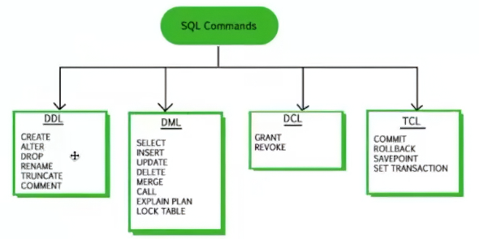

- [Fase 2 - Big Data Architecture](#fase-2---big-data-architecture)
  - [Banco de Dados Relacional (SQL)](#banco-de-dados-relacional-sql)
    - [Cadeias de comandos](#cadeias-de-comandos)
      - [DDL (Data Definition Language)](#ddl-data-definition-language)
      - [DML (Data Manipulation Language)](#dml-data-manipulation-language)
      - [DCL (Data Control Language)](#dcl-data-control-language)
      - [TCL (Transaction Control Language)](#tcl-transaction-control-language)
    - [Docker](#docker)
      - [Criando com um contâiner com PostgreSQL](#criando-com-um-contâiner-com-postgresql)
      - [Criando um contâiner com MongoDB](#criando-um-contâiner-com-mongodb)
  - [Big Data Structures](#big-data-structures)
    - [Diferença entre Data Lake e Data Warehouse](#diferença-entre-data-lake-e-data-warehouse)
    - [Data Werehouse (RedShift, BigQuery e SQL Data Warehouse)](#data-werehouse-redshift-bigquery-e-sql-data-warehouse)
      - [OLTP (Online Transaction Processing)](#oltp-online-transaction-processing)
      - [OLAP (Online Analytical Processing)](#olap-online-analytical-processing)
      - [RedShift](#redshift)
        - [Passos](#passos)
    - [Data Lake (S3, Data Lake e Data Lakehouse)](#data-lake-s3-data-lake-e-data-lakehouse)
      - [CLI](#cli)
        - [Comandos básicos do CLI para S3:](#comandos-básicos-do-cli-para-s3)
      - [boto3 Python SDK para AWS](#boto3-python-sdk-para-aws)
    - [Data lakehouse (Data bricks, Apache Iceberg e Delta Lake)](#data-lakehouse-data-bricks-apache-iceberg-e-delta-lake)
      - [Primeiros passos](#primeiros-passos)


# Fase 2 - Big Data Architecture

## Banco de Dados Relacional (SQL)
- **Definição**: Bancos de dados relacionais armazenam dados em tabelas estruturadas com linhas e colunas, utilizando SQL (Structured Query Language) para manipulação e consulta dos dados.

### Cadeias de comandos


#### DDL (Data Definition Language)
- **CREATE**: Cria novas tabelas ou bancos de dados.
- **ALTER**: Modifica a estrutura de tabelas existentes.
- **DROP**: Remove tabelas ou bancos de dados existentes.
- **RENAME**: Renomeia tabelas ou colunas.
- **TRUNCATE**: Remove todos os registros de uma tabela, mas mantém a estrutura da tabela.
- **COMMENT**: Adiciona comentários a tabelas ou colunas.

#### DML (Data Manipulation Language)
- **SELECT**: Recupera dados de uma ou mais tabelas.
- **INSERT**: Adiciona novos registros a uma tabela.
- **UPDATE**: Modifica registros existentes em uma tabela.
- **DELETE**: Remove registros de uma tabela.
- **MERGE**: Combina dados de duas tabelas com base em uma condição especificada.
- **CALL**: Executa procedimentos armazenados no banco de dados.
- **EXPLAIN PLAN**: Fornece informações sobre como o banco de dados executará uma consulta SQL.
- **LOCK TABLE**: Bloqueia uma tabela para evitar acesso concorrente durante operações críticas

#### DCL (Data Control Language)
- **GRANT**: Concede permissões a usuários ou roles para acessar ou manipular objetos do banco de dados.
- **REVOKE**: Remove permissões concedidas anteriormente a usuários ou roles.

#### TCL (Transaction Control Language)
- **COMMIT**: Salva todas as alterações feitas na transação atual.
- **ROLLBACK**: Desfaz todas as alterações feitas na transação atual.
- **SAVEPOINT**: Define um ponto intermediário dentro de uma transação para permitir rollback parcial.
- **SET TRANSACTION**: Configura propriedades da transação atual, como o nível de isolamento.

### Docker
- **Definição**: Docker é uma plataforma de código aberto que automatiza a implantação de aplicativos dentro de contêineres leves e portáteis.

#### Criando com um contâiner com PostgreSQL
- Para fazer o docker conversar via network:
```bash
docker network create --driver bridge minha-rede
```
Hash gerada: `409edcff53bc6dd9c78b1f5b27dd4ce75973fb5ddd71b26ed2a471c61ef0dec6`
Para conferir a rede:
```bash
docker network ls
```
- Comando para criar o contâiner com PostgreSQL:
```bash
docker run -d \
--name meu-postgres \
--network minha-rede \
-e POSTGRES_USER=ta \
-e POSTGRES_PASSWORD=102030 \
-e POSTGRES_DB=db_fiap \
-p 5433:5432 \
postgres:latest
```
Isso gerou a hash do contâiner: `7a124504d3b71805e0e94f6f6054a0ac8b184a4a1305addabaa30f20b624da4c`

- Para parar o contâiner:
```bash
docker stop 7a12
```
- Criando a imagem do PGADMIN:
```bash
docker run \
--name my-pgadmin \
--network=minha-rede \
-p 15432:80 \
-e PGADMIN_DEFAULT_EMAIL=rafael_tegazzini@hotmail.com \
-e PGADMIN_DEFAULT_PASSWORD=postgre \
-d dpage/pgadmin4
```

#### Criando um contâiner com MongoDB
- Comando para criar o contâiner com MongoDB:
```bash
docker run -d --name mongodb -p 27017:27017 mongo:7
```
- Comando para ver se está rodando:
```bash
docker ps
```

## Big Data Structures

### Diferença entre Data Lake e Data Warehouse
As diferenças entre Data Lake e Data Warehouse são significativas em termos de estrutura dos dados, flexibilidade, custo e casos de uso. O Data Lake é projetado para armazenar dados em seu formato bruto, oferecendo alta flexibilidade para lidar com dados variados, enquanto o Data Warehouse é estruturado para armazenar dados organizados e otimizados para consultas analíticas. O Data Lake é geralmente mais barato para grandes volumes de dados, mas pode exigir mais esforço para organizar e analisar os dados, enquanto o Data Warehouse pode ser mais caro devido à necessidade de estruturação e otimização, mas oferece melhor desempenho para consultas analíticas. Os casos de uso também diferem, com o Data Lake sendo mais adequado para análise avançada e aprendizado de máquina, enquanto o Data Warehouse é ideal para relatórios empresariais e suporte à decisão.

| Característica          | Data Lake                               | Data Warehouse                          |
|-------------------------|-----------------------------------------|-----------------------------------------|
| Estrutura dos Dados     | Armazena dados em seu formato bruto      | Armazena dados estruturados             |
| Flexibilidade           | Alta flexibilidade para dados variados   | Estrutura rígida, requer modelagem prévia |
| Custo                   | Geralmente mais barato para grandes volumes de dados | Pode ser mais caro devido à necessidade de estruturação e otimização |
| Casos de Uso            | Análise avançada, aprendizado de máquina, integração de dados | Relatórios empresariais, análise de negócios, suporte à decisão |

Mais: https://www.databricks.com/glossary/data-lake-vs-data-warehouse


### Data Werehouse (RedShift, BigQuery e SQL Data Warehouse)
São sistemas de armazenamento e análise de dados projetados para lidar com grandes volumes de dados e consultas complexas. Eles são otimizados para análise de dados e suporte à tomada de decisões, permitindo que as organizações armazenem, gerenciem e analisem grandes conjuntos de dados de forma eficiente. O ciclo dos dados em um data warehouse envolve a coleta, transformação, armazenamento e análise dos dados para obter insights valiosos para os negócios.


#### OLTP (Online Transaction Processing)
- **Definição**: OLTP é um sistema de processamento de transações online que é projetado para gerenciar grandes volumes de transações em tempo real, como vendas, reservas e operações bancárias. Ele é otimizado para operações de leitura e escrita rápidas, garantindo a integridade dos dados e a consistência durante as transações. Bastante usado para escritas.

#### OLAP (Online Analytical Processing)
- **Definição**: OLAP é um sistema de processamento analítico online que é projetado para consultas complexas e análise de grandes volumes de dados. Ele é otimizado para operações de leitura intensiva, permitindo que os usuários realizem análises multidimensionais, como agregações, drill-down e slice-and-dice, para obter insights estratégicos a partir dos dados armazenados. Bastante usado para leituras, agregações médias.

#### RedShift
- **Definição**: RedShift é um serviço de data warehousing em nuvem da Amazon Web Services (AWS) que permite armazenar e analisar grandes volumes de dados usando SQL. Ele é projetado para ser escalável, rápido e fácil de usar, oferecendo recursos como armazenamento em colunas, compressão de dados e otimização de consultas para melhorar o desempenho das análises. RedShift é amplamente utilizado para análise de dados empresariais, relatórios e inteligência de negócios.

##### Passos
1. **Criação do Cluster**: O primeiro passo é criar um cluster RedShift, que é um conjunto de nós de computação que armazenam e processam os dados. Você pode escolher o tipo e o número de nós com base nas suas necessidades de desempenho e capacidade.
2. **Abrir editor de query**: Após a criação do cluster, você pode usar o editor de query do RedShift para escrever e executar consultas SQL. O editor de query é uma interface gráfica que permite interagir com o cluster, criar tabelas, inserir dados e realizar análises.
3. **Criar tabelas**: Com o editor de query, você pode criar tabelas para armazenar seus dados. Você pode definir a estrutura das tabelas, incluindo os tipos de dados e as chaves primárias.
```sql 
CREATE TABLE vendas (
    id SERIAL PRIMARY KEY,
    produto VARCHAR(255),
    quantidade INT,
    preco DECIMAL(10, 2),
    data_venda DATE
);
```
4. **Subir dados no S3**: Para carregar dados no RedShift, você pode usar o Amazon S3 como um repositório intermediário. Você pode fazer upload dos seus arquivos de dados para um bucket do S3 e, em seguida, usar o comando COPY para importar os dados para as tabelas do RedShift.
```sql
-- REVER ESSA PARTE DE CREDENCIAIS, POIS NÃO É RECOMENDADO COLOCAR AS CHAVES DE ACESSO DIRETAMENTE NO CÓDIGO
COPY vendas
FROM 's3://meu-bucket/vendas.csv'
-- Credenciais IAM
CREDENTIALS 'iam_role=SEU_ACCESS_KEY;aws_secret_access_key=SEU_SECRET_KEY'
DELIMITER ','
IGNOREHEADER 1
CSV;
```
5. **Executar consultas**: Depois de carregar os dados, você pode executar consultas SQL para analisar os dados e obter insights. O RedShift é otimizado para consultas analíticas, permitindo que você execute operações complexas de agregação, junção e filtragem.
```sql
SELECT produto, SUM(quantidade) AS total_vendido
FROM vendas
GROUP BY produto
ORDER BY total_vendido DESC;
```

### Data Lake (S3, Data Lake e Data Lakehouse)
- **Definição**: Data Lake é um repositório centralizado que permite armazenar grandes volumes de dados em seu formato bruto, sem a necessidade de estruturação prévia. Ele é projetado para lidar com dados variados, incluindo dados estruturados, semiestruturados e não estruturados, e é frequentemente usado para análise avançada, aprendizado de máquina e integração de dados. O Data Lakehouse é uma arquitetura que combina os benefícios do Data Lake e do Data Warehouse, permitindo o armazenamento de dados em seu formato bruto, mas também oferecendo recursos de consulta e análise semelhantes aos de um Data Warehouse tradicional.

- **S3 (Simple Storage Service)**: O Amazon S3 é um serviço de armazenamento em nuvem da AWS que oferece escalabilidade, durabilidade e segurança para armazenar e recuperar qualquer quantidade de dados a qualquer momento. Ele é amplamente utilizado como um componente fundamental em arquiteturas de Data Lake, permitindo que as organizações armazenem grandes volumes de dados em seu formato bruto, facilitando a análise avançada e o aprendizado de máquina. O S3 oferece recursos como controle de acesso, versionamento de objetos e integração com outros serviços da AWS para facilitar a gestão e análise dos dados armazenados.

- **Tags dos buckets**: As tags são rótulos que podem ser atribuídos aos buckets do S3 para facilitar a organização, gerenciamento e controle de acesso aos dados. Elas permitem categorizar os buckets com base em critérios específicos, como ambiente (produção, desenvolvimento), departamento (vendas, marketing) ou tipo de dados (financeiros, clientes). As tags ajudam a identificar e localizar rapidamente os buckets relevantes, além de facilitar a aplicação de políticas de segurança e governança de dados. As tags podem ser colocadas direto nos buckets ou em objetos específicos dentro dos buckets, permitindo uma gestão mais granular dos dados armazenados no S3.

#### CLI
O CLI (Command Line Interface) é uma ferramenta de linha de comando que permite interagir com serviços e recursos de nuvem, como o Amazon S3, usando comandos de texto. Ele é amplamente utilizado para gerenciar e automatizar tarefas relacionadas ao armazenamento, como criar buckets, fazer upload e download de arquivos, configurar permissões e monitorar o uso do S3. O CLI oferece uma maneira eficiente e flexível de gerenciar os recursos do S3, especialmente para usuários que preferem trabalhar com a linha de comando ou precisam automatizar processos em larga escala. Com o CLI, os usuários podem executar operações complexas no S3 de forma rápida e fácil, sem a necessidade de acessar a interface gráfica do console da AWS.

Link para download: [Download CLI](https://docs.aws.amazon.com/cli/latest/userguide/getting-started-install.html)

##### Comandos básicos do CLI para S3:
- **Criar um bucket**:
```bash
aws s3 mb s3://meu-bucket
```
> `mb` significa make bucket, ou seja, criar um bucket com o nome especificado.

- **Listar buckets**:
```bash
aws s3 ls {bucket-name/path/path...} --region us-east-1
```
> `ls` significa list, ou seja, listar os buckets disponíveis.

- **Deletar um bucket**:
```bash
aws s3 rm s3://meu-bucket/path/file.csv
```
> `rm` significa remove, ou seja, remover o bucket especificado.

- **Copiar um arquivo para o S3**:
```bash
aws s3 cp "C:\Users\rafaeltegazzini\Documents\Pessoais\posGraduacao_MLE\app\Imagens\analogiaAPI.png" s3://meu-bucket/path/ --region us-east-1
```
> `cp` significa copy, ou seja, copiar um arquivo do local especificado para o bucket do S3.

#### boto3 Python SDK para AWS
O boto3 é o SDK (Software Development Kit) oficial da Amazon Web Services (AWS) para Python, que permite aos desenvolvedores interagir com os serviços da AWS de forma programática. Ele fornece uma interface de alto nível para acessar e gerenciar recursos da AWS, como S3, EC2, DynamoDB, entre outros. Com o boto3, os desenvolvedores podem criar scripts e aplicativos que automatizam tarefas relacionadas à AWS, como upload e download de arquivos no S3, gerenciamento de instâncias EC2 e manipulação de dados em bancos de dados DynamoDB. O boto3 é amplamente utilizado para integrar aplicativos Python com os serviços da AWS, facilitando a construção de soluções escaláveis e eficientes na nuvem.
```python
import boto3
from botocore.exceptions import NoCredentialsError

def handle_s3(file_name, bucket, access_key, secret_key, action, object_name=None, prefix=None):
    """
    Autor: Vinicius Henrique dos Santos 
    Empresa: FIAP
    Materia: Big Data Storage Structures
    Objetivo: Interagir com o data lake atraves do python 

    === Parametros ===

    file_name: Caminho completo do arquivo a ser enviado ou deletado, ex 'C:\Users\vinic\Downloads\pedidos.csv'
    bucket: Nome do bucket S3 para o qual o arquivo será enviado ou de onde será deletado.
    access_key: AWS Access Key ID.
    secret_key: AWS Secret Access Key.
    action: 'upload' para enviar o arquivo, 'delete' para deletar o arquivo do bucket, 'list' para ver os arquivos do bucket
    object_name: Nome do objeto no bucket S3. Se None, file_name.
    prefix: se voce deseja que o arquivo tenha prefixo no S3, usar.
    True se a ação foi realizada com sucesso, False caso contrário.
    """
    session = boto3.Session(
        aws_access_key_id=access_key,
        aws_secret_access_key=secret_key
    )
    s3_client = session.client('s3')

    try:
        if action == 'upload':
            if object_name is None:
                object_name = file_name.split('/')[-1]
            if prefix:
                object_name = f"{prefix}/{object_name}"
            s3_client.upload_file(file_name, bucket, object_name)
        elif action == 'delete':
            if object_name is None or prefix:
                raise ValueError("Para deletar um objeto, o 'object_name' deve ser especificado e 'prefix' deve ser None ou vazio.")
            s3_client.delete_object(Bucket=bucket, Key=object_name)
        elif action == 'list':
            paginator = s3_client.get_paginator('list_objects_v2')
            for page in paginator.paginate(Bucket=bucket, Prefix=prefix):
                for obj in page.get('Contents', []):
                    print(obj['Key'])
        else:
            print(f"Ação '{action}' não reconhecida.")
            return False
    except NoCredentialsError:
        print("As credenciais não estão disponíveis")
        return False
    except ValueError as ve:
        print(ve)
        return False
    except Exception as e:
        print(f"Erro ao realizar ação '{action}' no arquivo: {e}")
        return False

    return True

# Exemplo de uso para upload:
#handle_s3(r'C:\Users\vinic\Downloads\pedidos.csv',\
#          'fiap-mlet-vinicius-2024',\
#          '<access_key>',\
#          '<secret_key>',\
#          'upload',\
#          'pedidos.csv',\
#          'SP')

# Exemplo de uso para delete:
#handle_s3('pedidos.csv',\
#          'fiap-mlet-vinicius-2024',\
#          '<access_key>',\
#          '<secret_key>',\
#          'delete',\
#          'pedidos.csv',\
#          'SP')

# Exemplo de uso para listagem:
#handle_s3(None,\
#          'fiap-mlet-vinicius-2024',\
#          '<access_key>',\
#          '<secret_key>',\
#          'list',\
#          prefix='SP')
```

### Data lakehouse (Data bricks, Apache Iceberg e Delta Lake)
- **Definição**: O Data Lakehouse é uma arquitetura de armazenamento de dados que combina os benefícios do Data Lake e do Data Warehouse, permitindo o armazenamento de dados em seu formato bruto, mas também oferecendo recursos de consulta e análise semelhantes aos de um Data Warehouse tradicional. Ele é projetado para lidar com grandes volumes de dados variados, proporcionando flexibilidade para análise avançada e aprendizado de máquina, ao mesmo tempo em que oferece desempenho otimizado para consultas analíticas. O Data Lakehouse é uma solução moderna para organizações que buscam aproveitar ao máximo seus dados, permitindo a integração de dados estruturados e não estruturados em um único repositório, facilitando a análise e a tomada de decisões baseada em dados.

Vamos começar usando a versão gratuita: [Community Edition](https://community.cloud.databricks.com/)
Email: boolish99@gmail.com
Senha: Padrão

#### Primeiros passos
1. Criar um cluster: No Databricks, você pode criar um cluster para executar seus notebooks e processar seus dados. O cluster é composto por nós de computação que trabalham juntos para executar suas tarefas. No Community Edition, a conta já vem com um cluster pré-configurado.
2. Criar um notebook: Depois de criar o cluster, você pode criar um notebook para escrever e executar seu código. O Databricks suporta várias linguagens de programação, incluindo Python e SQL.
```python 
#pip install databricks-sql-connector
from databricks import sql
import os

connection = sql.connect(
                        server_hostname = "dbc-872a3102-6bc7.cloud.databricks.com",
                        http_path = "/sql/1.0/warehouses/455a49b57a50e4b2",
                        access_token = "<access_token>"
                        )

cursor = connection.cursor()

cursor.execute("SELECT * from range(10)")
print(cursor.fetchall())

cursor.close()
connection.close()
```
3. Carregar dados: Você pode carregar seus dados para o Databricks usando o recurso de upload de arquivos ou conectando-se a fontes de dados externas, como Amazon S3, Azure Blob Storage ou bancos de dados relacionais.